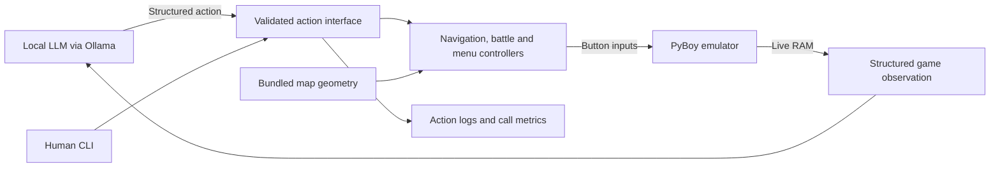

# DeepRed

**Let a local language model play Pokémon Red—without sending it screenshots.**

DeepRed turns emulator RAM into structured observations and gives an LLM actions for navigation, NPC interaction, starter selection, battles, and menus. The model chooses what to do; Python controllers handle button presses, walking, doors, and mandatory dialogue. The aim is a fun way to watch AI play, without training a game-playing policy.

**Status: working local prototype.** Early-game journeys and individual service flows have been verified. Completing the entire game autonomously has not.

## Demo

<!-- Add the recorded walkthrough link here when available. Do not commit ROMs or saves. -->

Recording option: launch with `uv run main.py --auto-flee` to enable a controller policy that attempts escape up to twice per wild encounter before returning decisions to the model. It is off by default. The console and game panel label these as automatic attempts, and they do not count as LLM calls. When adding a video recorded with this option, disclose that wild-encounter escape attempts used this policy.

The model's goal is **“Reach VIRIDIAN_CITY.”** This is a destination-directed demo: the target is supplied, while the model chooses gameplay actions from RAM observations. DeepRed handles intermediate maps, pauses for the starter decision, lets the model choose moves in battle, and resumes interrupted journeys afterward.

Watch the game and model decisions together in one window. A human CLI provides the same gameplay actions for manual testing.

The prompt also encourages exploring unfamiliar places, avoiding repeated backtracking without a reason, and trying another destination or interaction when an action makes no progress. This is general exploration guidance; it does not supply a route or walkthrough.

The model receives visit counts and a compact memory of observed dialogue, first NPC interactions, and changes to party, inventory, money, or badges. Successful automatic actions no longer displace the last six model outcomes. The current travel limit rejects the second identical directed trip without new observations: `X → Y → X` cannot immediately continue to `Y`. `AgentMemory.TRIP_LIMIT` controls this limit and the warning threshold together. The rejection is returned to the model so it can choose another destination or interaction. Three consecutive failures stop the run. Discovering a map, new dialogue, a first NPC interaction, or a tracked state change resets the travel counter. These are observed-change heuristics, not a complete story-progress tracker. Memory lasts for the current run and is not restored from emulator checkpoints.

For the clean recording view, simply run:

```powershell
uv run python -X utf8 main.py
```

Defaults: **visible game + decision panel**, **qwen3:4b**, **30 model calls**, and
the goal **“Reach VIRIDIAN_CITY.”** A local stopping rule ends
the run upon arrival in Viridian City outside battle/dialogue.
Supply `--save PATH` if your
checkpoint is not `saves/in-room-start.state`.

The panel shows the persistent goal, current model choice, last five choices,
travel destination, and call count. It stays open on the final frame until you
close it. The console prints readable model choices, a short startup/stop message,
and the saved run path. It does not print automatic advances or routing chatter.
Detailed diagnostics remain in the run folder. Use `--verbose` to print them,
`--headless` to hide the window, or `--no-overlay` for the plain PyBoy window.
The integrated panel uses Tkinter; `--no-overlay` is also available for Python
builds without Tk support. Presentation pixels are never sent to the model.
Press **Space** while the game window is focused to toggle **1x / unlimited**
emulation speed, just like PyBoy. The current mode appears below the panel.
This speeds up gameplay, not model inference; the game still pauses for decisions.

### Historical directed-navigation run

On 21 September 2026, a headless run from a bedroom checkpoint reached Route 1
with **`qwen3:4b` choosing Bulbasaur itself**:

| Model decisions | Calls |
| --- | ---: |
| Request the final destination | 1 |
| Choose a starter | 1 |
| Choose moves in the rival battle | 6 |
| **Total** | **8** |

Eight dialogue advances and two route resumes required **zero model calls**.
Ollama reported **11,966 input tokens and 148 output tokens**. The run used
thinking disabled, temperature 0, an 8,192-token context, and `--stop-at ROUTE_1`.
Its goal was: “Choose whichever starter you prefer, then reach ROUTE_1. Request
ROUTE_1 as your final destination.”

This earlier trial explicitly supplied the destination; it does not demonstrate
independent progression under the current gameplay-only instruction.
This is one observed early-game run, not a success-rate benchmark. Starting
checkpoint, game RNG, prompt, and model behavior can change the outcome and counts.

## How it works



- **Memory-based observations:** location, party, HP, moves and PP, inventory, dialogue, NPC objects, menus, and available actions. No screenshot perception.
- **Destination-level navigation:** `navigate ROUTE_1` crosses intermediate maps automatically. Routing combines map connectivity, walkable terrain, and live object occupancy checks.
- **Explicit choices:** starter, battle moves, supported items and switches, NPC interactions, and shop/healing options.
- **Automatic continuation:** mandatory dialogue advances locally; interrupted travel resumes after battle. Blockers return control to the model.
- **Observable execution:** bounded retries, call/token metrics, JSONL traces, manual checkpoints, and periodic saves during AI runs.

The action interface is provider-independent. **Ollama is the implemented adapter today**; other local or cloud providers can use the same interface.

## Why it runs locally

DeepRed ships the controller, not a copy of Pokémon Red. **ROMs, cartridge saves, and emulator checkpoints are not distributed with this repository.** Supply your own game assets that you are entitled to use. No game download links or instructions for obtaining unauthorized copies are provided.

This release has no hosted playable demo: setup is deliberately local, using user-supplied assets. A recorded walkthrough can demonstrate it without bundling a playable copy of the game. This is a packaging choice, not a claim that browser-based emulation is technically impossible.

Pokémon and related game content belong to their respective owners. DeepRed is an independent fan project, unaffiliated with Nintendo, Game Freak, or The Pokémon Company. The checked-in navigation data is derived from pinned `pret/pokered` source; see [data provenance](game_data/README.md).

## Quick start

Tested on Windows with Python 3.11.9 and PyBoy 2.7.0. Install [uv](https://docs.astral.sh/uv/getting-started/installation/), then run from the repository directory:

```powershell
uv sync --locked
```

### Supply the ROM and create a checkpoint

Place your supported Pokémon Red ROM at `Pokemon_Red/Red.gb`. The demos validate SHA-1 `ea9bcae617fdf159b045185467ae58b2e4a48b9a` before starting. Other revisions, languages, and ROM hacks are not currently supported. Navigation uses `game_data/pokemon_red.json`; **no external pokered checkout is needed**.

Already have a compatible PyBoy checkpoint? Pass it with `--save`. Otherwise, boot your ROM:

```powershell
uv run python -m pyboy Pokemon_Red/Red.gb
```

Play through the introduction until Red is standing in his bedroom and the text has closed. In the game window: **arrow keys** move, **A** is the Game Boy A button, **S** is B, **Enter** is Start, and **Backspace** is Select. Press and release **Z** to save `Pokemon_Red/Red.gb.state`, then close the window. Z replaces that standalone PyBoy checkpoint if it already exists.

The examples below load that file explicitly. The demos' default `saves/in-room-start.state` is a local convenience and is not included.

### Start Ollama and let the model play

Install/start [Ollama](https://ollama.com/) and obtain a model that fits your machine:

```powershell
ollama pull qwen3:4b
uv run python -X utf8 main.py --save Pokemon_Red/Red.gb.state
```

`--model` defaults to `qwen3:4b`; `--url` defaults to `http://localhost:11434`. The adapter uses [structured JSON responses](https://docs.ollama.com/capabilities/structured-outputs).

The game and decision panel are visible at normal speed by default. Use `--headless` to run without a window. The game pauses during inference while the window remains responsive. Close the window or press Ctrl+C to stop. `ai_demo.py` remains an alternative entry point with the same defaults as `main.py`.

`--stop-at ROUTE_1` changes only the local arrival stop; `--no-stop-at` disables it. Neither changes the model's fixed Viridian City goal. The model receives that goal, tool instructions, current observations, and recent outcomes. A model `finish` response is a claim to inspect, not independent proof of goal completion.

## Human CLI and checkpoints

```powershell
uv run python -X utf8 demo.py --save Pokemon_Red/Red.gb.state --no-headless --auto-advance
```

The CLI prints current state and valid actions:

| Command | Purpose |
| --- | --- |
| `navigate ROUTE_1` | Travel to a final destination across maps |
| `choose_starter bulbasaur` | Choose a starter when Oak offers the decision |
| `interact 1` | Approach an NPC/object using its printed slot |
| `fight 0` | Choose a move by zero-based index |
| `switch 1` | Send out a healthy reserve party member |
| `use_item 2 0` | Use bag item 2 on party member 0, where supported |
| `choose 0` / `quantity 3` | Choose a menu option / shop quantity |
| `advance` / `resume` | Advance text / continue interrupted travel |
| `cancel` / `run` | Back out of a supported menu / attempt to flee |
| `observe` / `json` / `help` | Inspect state and command syntax |
| `/save` | Create a timestamped checkpoint in `saves/` |
| `/save saves/after-healing.state` | Save to a chosen new filename |
| `quit` | Exit without another save |

`--auto-advance` stops at choices. Without it, issue `advance` when listed. Indices start at zero except NPC/object slots, which use their printed numbers. Shared sprites use generic role labels rather than guessed identities. Interaction supports talking over counters.

CLI saves never overwrite existing files. Load one in either runner:

```powershell
uv run python -X utf8 main.py --save saves/after-healing.state --no-stop-at --max-calls 20
```

Checkpoints preserve the emulator, including battles and menus. Model history, window settings, and pending navigation destinations are not included; the model replans from the observed state. Set any desired runner limits again.

## Measuring calls and inspecting failures

Each run creates an ignored `status/llm-runs/<timestamp>/` directory:

- `events.jsonl`: exact prompts, responses, action results, and final summary.
- `controller.log`: low-level routing and controller output hidden from the clean console (use `--verbose` to print it instead).
- `summary.json`: calls by decision type, automatic actions, token usage, timings, and stopping reason. After interruption, use the summary event in the JSONL log.
- `checkpoint-*.state`: emulator checkpoints every ten actions and on exit.

Model choices require model calls; mandatory advances, route resumes, and optional `--auto-flee` escape attempts do not. Auto-flee never applies to trainer battles, tutorials, or forced-switch/menu decisions. Escape is not guaranteed; after two attempts in a still-active wild encounter the model receives control and the attempt history. Encounter budgets reset when an observation shows the battle has ended. The run log records whether the policy was enabled, each automatic action, and separate automatic-action totals. Counts include invalid responses, failed requests, and model `finish` responses, with no hidden HTTP retries. Token totals are backend-reported; missing usage is tracked separately. These are per-run measurements, not full-game or cloud-billing estimates.

Limits include `--max-calls` (default 30), `--max-actions` (200), repeated failures, unchanged observations, and repeated travel cycles. Six recent model outcomes (or automatic failures) accompany the current state, plus visit counts and up to eight notable observations. `--think` enables reasoning on supported Ollama models and is off by default. `--no-auto-resume` lets the model decide when to continue interrupted travel.

Automatic actions stop with `automatic_no_progress` after eight consecutive actions leave the observation unchanged. Successful escape/dialogue/travel sequences can continue beyond eight automatic actions, subject to the total action budget. The call count printed on shutdown always counts model requests, not automatic actions.

## Scope and limitations

Verified controller flows include early-game multi-map travel, starter selection, battle move selection, nickname rejection, Oak's parcel delivery, shopping, and healing. Grouped unit tests and real-emulator integration tests cover validation, menus, interruptions, call accounting, and shutdown.

- **No verified full-game completion.** Working controller flows do not establish that a small model can plan an entire playthrough.
- Models can repeat decisions or finish prematurely. Logs and budgets expose and bound those failures.
- Navigation does not provide generalized Surf/Cut/Strength or ledge planning. Special transitions, story gates, and some terrain remain unsupported.
- Bundled geometry describes terrain beyond the screen. Live RAM does not provide continuously simulated offscreen NPC positions; interaction rechecks visibility.
- Menu support covers implemented battle/service flows, not every PC, trade, minigame, or special event. Unknown menus stop automation.
- `main.py` launches the AI. The older fixed-policy loop is retained separately in `autonomous_controller/scripted_demo.py` for regression tools.

See [navigation notes](NAVIGATION.md) and [data limitations](game_data/README.md). Next priorities: longer multi-step runs, better progress observations, and broader story/menu coverage. More providers and a hosted UI are future work.

## Development

```powershell
uv run ruff check .
uv run ruff format --check .
uv run pytest
```

For tests without game assets: `uv run pytest -m "not integration and not source_data"`. Integration tests skip when local ROM/checkpoint files are missing. The optional `source_data` check requires the pinned source checkout. No automatic commit hooks are installed. Apply changes manually with `uv run ruff check . --fix` and `uv run ruff format .`.

The real escape regression uses `saves/wild-escape.state`, a local wild-battle checkpoint known to permit escape within two attempts. To replay other such fixtures, set `DEEPRED_WILD_STATES` to their paths separated by your platform's path separator (`;` on Windows). The test checks the engine's escape message, battle termination, unchanged move PP/inventory, and zero model calls; it never overwrites checkpoints.

`AgentInterface.observe()`, `action_schema()`, and `execute()` are the shared contract. Observations never advance emulation. Results include a status, detail, and fresh observation; `submitted` means inputs were sent, not that an attack or escape succeeded. The session owner handles cleanup.

Further tools: `scratch/navigation_regression.py` for scripted travel, `autonomous_controller.save_state` for checkpoint helpers, and [the data exporter](game_data/README.md#optional-regeneration) for maintainers. Optional notebooks use `uv sync --locked --all-groups`. Game assets, generated checkpoints, and session reports remain local.

Built with [PyBoy](https://github.com/Baekalfen/PyBoy), [Ollama](https://ollama.com/), and navigation data derived from [pret/pokered](https://github.com/pret/pokered).
