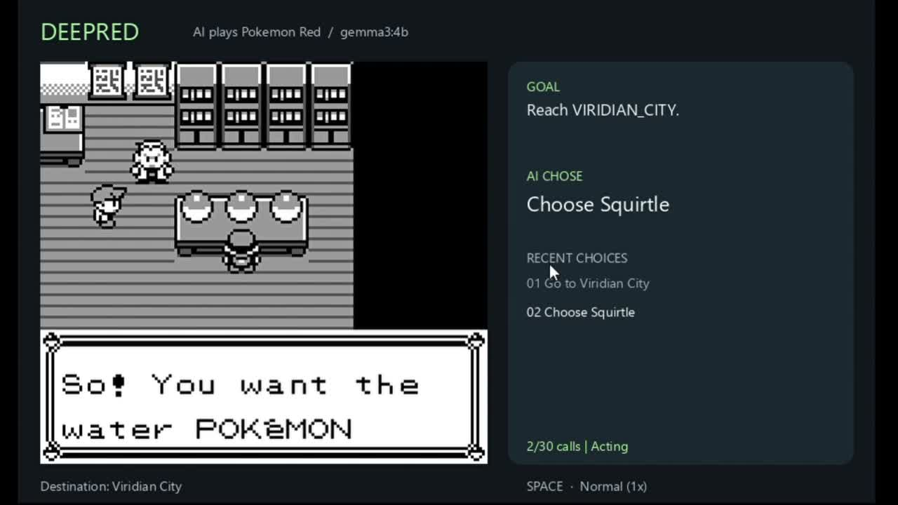
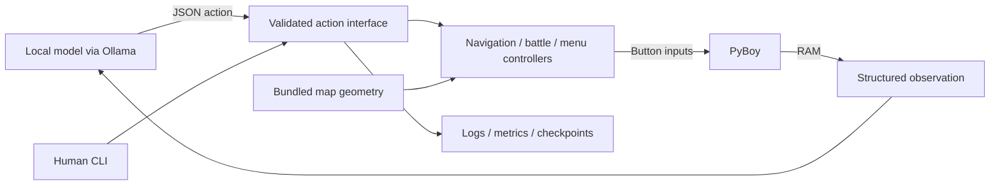

# DeepRed

**A local LLM plays Pokémon Red through structured game state—without seeing the screen.**

DeepRed connects a language model to a running Game Boy emulator. It reads RAM into structured observations, accepts validated gameplay actions, and translates them into button presses. The model chooses destinations, a starter, battle moves, and supported interactions; deterministic controllers handle walking, menus, and interruptions.

Built for the fun of watching an LLM play, and to explore the engineering needed to make model decisions work in a stateful environment. **Working local prototype: early-game journeys and individual gameplay flows are verified. Full-game autonomous completion is not claimed.**

Python 3.11 · PyBoy · Ollama · A* / graph search · pytest · Ruff · uv

## Watch the demo

[](https://youtu.be/utg3bTg0Dbs)

**[Watch the 74-second demo on YouTube](https://youtu.be/utg3bTg0Dbs)**

The video shows **Gemma 3 4B** choosing Squirtle, handling the rival battle, and travelling through Route 1 to Viridian City. Playback is **4× speed**, with repeated Tackle turns cut and labelled “6 Tackles later.” This is an edited demonstration, not a real-time latency measurement.

The prompt explicitly names `VIRIDIAN_CITY` and instructs the model to request that final destination. This demonstrates **execution of a supplied goal**, not independent discovery of the next story objective. The model chooses the starter and battle actions. Controllers handle navigation, compulsory dialogue, nickname rejection, and resuming interrupted travel.

The optional **`--auto-flee` policy is enabled in this recording**. It attempts escape up to twice per wild encounter, then returns decisions to the model if combat continues. It is off by default. The panel distinguishes **AI CHOSE** from **AUTO POLICY**; automatic escape entries are labelled separately and do not increase the model-call counter. The emulator's “Normal (1×)” label describes the original recording; the video edit is accelerated.

The matching recorded run reached Viridian City with **16 model calls**: one destination request, one starter choice, and 14 battle decisions. Another **26 dialogue advances, five travel resumes, and four escape attempts** required no model calls. These are results from one run, not a success-rate benchmark or a guarantee for other models and saves. Arrival was checked against game state rather than accepted from a model's claim.

## Engineering highlights

- **A shared action interface:** `observe()`, `action_schema()`, and `execute()` serve both the LLM runner and a human CLI. Arguments and current game state are checked before controller execution.
- **Navigation beyond the viewport:** a versioned terrain bundle supplies full-map geometry. A* plans walking paths; graph search routes through connected map regions, doors, and overworld boundaries. Live RAM supplies player position and visible NPC occupancy.
- **Interruptible execution:** a destination request can span multiple maps, pause for starter selection or combat, and resume afterward. Movement is checked against actual emulator state; bounded recovery handles blocked steps and unexpected transitions.
- **Memory and failure handling:** compact visit/dialogue history, repeated-trip rejection, frame/action budgets, and model-call limits bound failure modes. These safeguards are explicit controller behavior, not evidence that the model always reasons correctly.
- **Inspectable runs:** JSONL records prompts, responses, and outcomes. Separate model/automatic counters, token usage, checkpoints, and a live decision panel make behavior reviewable.



No screenshot or video is sent to the model. The displayed game is for the viewer. This does not mean the system has no map knowledge: the controller has bundled terrain, and the model receives local exits and decoded game state. There is no project-specific model training or reinforcement-learning pipeline.

## Run it locally

Tested on Windows with Python 3.11.9 and PyBoy 2.7.0. Install [uv](https://docs.astral.sh/uv/getting-started/installation/) and [Ollama](https://ollama.com/), and start Ollama. A compatible ROM and initial emulator checkpoint are required; neither is included.

```powershell
git clone https://github.com/InsaneJSK/DeepRed.git
cd DeepRed
uv sync --locked
ollama pull gemma3:4b
```

1. Put your supported Pokémon Red ROM at `Pokemon_Red/Red.gb`. Expected SHA-1: `ea9bcae617fdf159b045185467ae58b2e4a48b9a`. Other revisions and ROM hacks are rejected.
2. Create a starting checkpoint:

   ```powershell
   uv run python -m pyboy Pokemon_Red/Red.gb
   ```

   Play through the introduction until Red stands in his bedroom with dialogue closed. Arrow keys move; **A/S** are the Game Boy A/B buttons, **Enter** is Start, and **Backspace** is Select. Press and release **Z** to save `Pokemon_Red/Red.gb.state`, then close the window. Z overwrites that standalone checkpoint if it already exists.
3. Run the same policy configuration as the recording:

   ```powershell
   uv run python -X utf8 main.py --save Pokemon_Red/Red.gb.state --model gemma3:4b --auto-flee
   ```

Omit `--auto-flee` to leave wild-battle choices to the model. Defaults are **Gemma 3 4B**, a visible game/decision window, **30 model calls**, and the goal **“Reach VIRIDIAN_CITY.”** Arrival outside battle/dialogue stops the run. The default checkpoint path, `saves/in-room-start.state`, is a local convenience; a fresh clone should use the explicit `--save` path above.

**Ollama is the only implemented model adapter.** Use `--model` for another installed model or `--url` for another Ollama server. The action interface can support more adapters, but arbitrary providers are not plug-and-play today.

Press **Space** in the focused game window to toggle normal/unlimited emulation speed. The game pauses during inference; faster emulation does not accelerate the model. Close the window or press Ctrl+C to stop. The final frame stays open after completion.

For headless mode, checkpoints, CLI commands, prompt changes, logs, and troubleshooting, see the [usage guide](docs/USAGE.md).

## What works—and the current boundary

| Area | Current scope |
| --- | --- |
| Travel | Early-game multi-map journeys, doors, overworld connections, visible NPC avoidance, interrupt/resume |
| Battles | Move selection, supported switches/items, capture handling, optional bounded wild-encounter escape |
| Interactions | Starter selection, nickname rejection, NPC/object interaction including counters, supported shopping/healing menus |
| Decisions | Destination-directed demo with model-selected gameplay actions; memory and bounded recovery |
| Validation | Grouped unit tests and local real-emulator regressions; this video demonstrates a subset of supported flows |

Small models can still repeat poor actions, misunderstand context, or finish prematurely. Escape attempts can fail in the game. The successful run does not establish full-game planning, battle strategy quality, or reliability across models.

Navigation does not provide generalized Surf/Cut/Strength, ledge-jump or puzzle planning. Static terrain does not cover every event-driven map change. Offscreen NPC records are not a continuously simulated occupancy map. Some scripted transitions and menus remain unsupported. Model memory is limited and run-local; emulator saves do not restore it. See [navigation design and limitations](NAVIGATION.md) and [data provenance](game_data/README.md).

## Inspect and test

Useful starting points for a code review:

| File / directory | Responsibility |
| --- | --- |
| [agent_interface.py](autonomous_controller/agent_interface.py) | Structured observations, action schema and validation |
| [llm_runner.py](autonomous_controller/llm_runner.py) | Prompt, Ollama requests, policy execution and budgets |
| [agent_memory.py](autonomous_controller/agent_memory.py) | Exploration history and repeated-trip rejection |
| [controller.py](autonomous_controller/controller.py), [world_graph.py](autonomous_controller/world_graph.py) | Interruptible travel and cross-map routing |
| [battle_controller.py](autonomous_controller/battle_controller.py), [overworld_menu.py](autonomous_controller/overworld_menu.py) | Emulator menu control |
| [memory_state/](memory_state/) | RAM decoding |
| [tests/](tests/) | Behavioral regressions, including real-emulator checks |

```powershell
uv run ruff check .
uv run ruff format --check .
uv run pytest -m "not integration and not source_data"
```

The last command exercises tests without game assets. `uv run pytest` also runs available emulator tests; missing local fixtures are skipped. Some integration branches deliberately seed RAM to isolate menu behavior, while others replay saved gameplay. Normal controller execution uses game inputs. The optional source-data parity check needs the pinned upstream checkout; **running DeepRed does not**. See [testing details](docs/USAGE.md#testing) and [data documentation](game_data/README.md).

## Game assets and deployment

This repository distributes the controller and navigation bundle, **not the ROM, cartridge saves, or emulator checkpoints**. Supply your own game assets that you are entitled to use. No game download links are provided.

There is no hosted playable demo in this release: it runs locally with user-supplied assets. The recorded video lets reviewers see the system without setting up the game. Browser deployment would require additional engineering and an appropriate asset-handling design; it is not a completed feature.

Pokémon and related game content belong to their respective owners. DeepRed is an independent fan project, unaffiliated with Nintendo, Game Freak, or The Pokémon Company. Navigation data is derived from a pinned [pret/pokered](https://github.com/pret/pokered) revision, with provenance recorded in [game_data/README.md](game_data/README.md).

Built with [PyBoy](https://github.com/Baekalfen/PyBoy) and [Ollama](https://ollama.com/).
